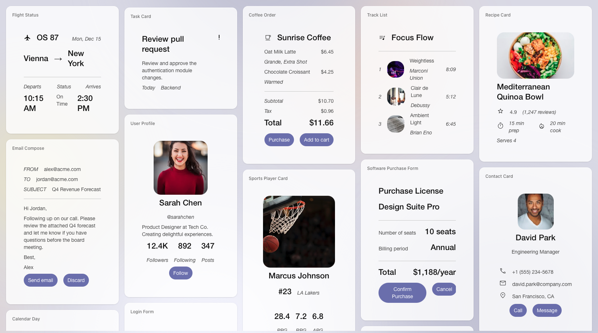

# A2UI: Agent-to-User Interface (エージェント・トゥ・ユーザー・インターフェース)

A2UIは、エージェントによって生成・更新されるUIを表現するために最適化されたオープンソースプロジェクトです。定義フォーマットと初期のレンダラーセットで構成されており、エージェントがリッチなユーザーインターフェースを生成したり、データを入力したりすることを可能にします。



*A2UIでレンダリングされたカードのギャラリー。A2UIで実現可能な多様なUI構成を示しています。*

## ⚠️ ステータス: 早期パブリックプレビュー

> **注意:** A2UI の現在の本番リリースは、安定版 v0.9 プロトコルファミリーのパッチリリースである **v0.9.1** です。v1.0 仕様はリリース候補であり、v0.8 はレガシーとなっています。仕様および実装は機能していますが、現在も進化を続けています。コラボレーションを促進し、フィードバックを収集し、コントリビューション（特にクライアントレンダラーについて）を募るために、プロジェクトを公開しています。今後も変更が加えられる可能性があることをご了承ください。

## 概要

生成AIはテキストやコードの生成には優れていますが、エージェントがユーザーにリッチでインタラクティブなインターフェースを提示しようとすると、特にエージェントがリモートで動作している場合や信頼境界を超えて動作している場合に、困難が生じることがあります。

**A2UI**は、エージェントが「UIを話す」ことを可能にするオープンスタンダードおよびライブラリセットです。エージェントはUIの「意図」を記述した宣言型のJSONフォーマットを送信します。クライアントアプリケーションは、これを自身が持つネイティブコンポーネントライブラリ（Flutter、Angular、Litなど）を使用してレンダリングします。

このアプローチにより、エージェントが生成するUIは、**「データのように安全でありながら、コードのように表現力豊か」**になります。

## ハイレベルな理念

A2UIは、エージェントによる相互運用可能なマルチプラットフォーム対応の、生成型またはテンプレートベースのUIレスポンス特有の課題を解決するために設計されました。

プロジェクトの核となる理念は以下の通りです：

* **セキュリティ第一 (Security first)**: LLMによって生成された任意のコードを実行することは、セキュリティリスクを伴う可能性があります。A2UIは宣言型のデータフォーマットであり、実行可能なコードではありません。クライアントアプリケーションは、信頼できる事前承認済みのUIコンポーネント（カード、ボタン、テキストフィールドなど）の「カタログ」を保持し、エージェントはそのカタログに含まれるコンポーネントのレンダリングのみをリクエストできます。
* **LLMフレンドリーかつ段階的な更新 (LLM-friendly and incrementally updateable)**: UIはIDで参照されるコンポーネントのフラットなリストとして表現されます。これにより、LLMが段階的に生成しやすくなり、プログレッシブレンダリングとレスポンスの良いユーザー体験が可能になります。エージェントは、会話の進行に伴う新しいユーザーリクエストに基づいて、UIを効率的かつ段階的に変更できます。
* **フレームワーク非依存かつポータブル (Framework-agnostic and portable)**: A2UIはUIの構造と実装を分離します。エージェントはコンポーネントツリーの説明と、それに関連付けられたデータモデルを送信します。クライアントアプリケーションは、これらの抽象的な説明を、Webコンポーネント、Flutterウィジェット、Reactコンポーネント、SwiftUIビューなど、自身のネイティブウィジェットにマッピングする責任を持ちます。エージェントからの同じA2UI JSONペイロードを、異なるフレームワークで構築された複数の異なるクライアントでレンダリングできます。
* **柔軟性 (Flexibility)**: A2UIは、開発者がサーバー側の型をネイティブモバイルウィジェットからReactコンポーネントまで、カスタムクライアントの実装にマッピングできるオープンレジストリパターンも備えています。「スマートラッパー (Smart Wrapper)」を登録することで、既存のあらゆるUIコンポーネント（レガシーコンテンツ用の安全なiframeコンテナを含む）をA2UIのデータバインディングおよびイベントシステムに接続できます。重要なのは、これによりセキュリティが開発者の手に委ねられ、コアシステムだけに頼るのではなく、カスタムコンポーネントのロジック内で厳格なサンドボックスポリシーや「信頼のはしご (trust ladders)」を直接実行できる点です。

## ユースケース

以下のようなユースケースが含まれます：

* **動的なデータ収集:** エージェントが、会話の特定のコンテキスト（例：専門的な予約の申し込み）に基づいて、オーダーメイドのフォーム（日付選択、スライダー、入力項目）を生成します。
* **リモートサブエージェント:** オーケストレーターエージェントが、タスクをリモートの専門エージェント（例：旅行予約エージェント）に委任し、そのエージェントがメインのチャットウィンドウ内でレンダリングされるUIペイロードを返します。
* **適応型ワークフロー:** ユーザーのクエリに基づいて、承認ダッシュボードやデータの可視化をオンザフライで生成するエンタープライズエージェント。

## アーキテクチャ

A2UIのフローは、UIの生成とUIの実行を切り離します：

1. **生成 (Generation):** エージェント（Geminiまたは他のLLMを使用）が、UIコンポーネントの構成とそのプロパティを記述したJSONペイロードである`A2UI Response`を生成または使用します。
2. **伝送 (Transport):** このメッセージがクライアントアプリケーションに送信されます（A2A、AG-UIなどを介して）。
3. **解決 (Resolution):** クライアントの**A2UI Renderer**がJSONを解析します。
4. **レンダリング (Rendering):** レンダラーが抽象的なコンポーネント（例：`type: 'text-field'`）を、クライアントのコードベース内の具体的な実装にマッピングします。

## 依存関係

A2UIは軽量なフォーマットとして設計されていますが、大きなエコシステムの一部として機能します：

* **伝送 (Transports):** **A2A Protocol**および**AG-UI**と互換性があります。
* **LLM:** JSON出力が可能なあらゆるモデルで生成可能です。
* **ホストフレームワーク:** サポートされているフレームワーク（現在はWebまたはFlutter）で構築されたホストアプリケーションが必要です。

## はじめに

目的に合った方法を選んでください：

| パス                                                                                                                          | 得られるもの                                                                                                                            | 所要時間   |
| ----------------------------------------------------------------------------------------------------------------------------- | --------------------------------------------------------------------------------------------------------------------------------------- | ------ |
| 🍜 **[クイックスタート：レストラン検索デモ](https://a2ui.org/quickstart/)**                                                      | Gemini を活用した ADK エージェントと Lit レンダラーによる、フルスタックの A2UI をローカルで動かせます。A2UI をエンドツーエンドで学び、自分のユースケースに合わせてカスタマイズできます。 | 約5分 |
| ⚛️ **[任意のエージェントフレームワークとハーネスで A2UI を使う](docs/public/guides/a2ui-with-any-agent-framework.md)**                     | 好みのフレームワーク向けに AG-UI アプリまたはハーネスをスキャフォールドし、AG-UI 経由で A2UI レンダリングを有効化できます。                                   | 約5分 |
| 🎨 **[A2UI Composer](https://a2ui-composer.ag-ui.com/)** ・ **[Widget Builder](https://go.copilotkit.ai/A2UI-widget-builder)** | ビジュアルエディターで A2UI の JSON を生成し、任意のエージェントプロンプトに貼り付けるだけです。インストール不要。                                                       | 約1分 |
| 🎬 **[A2UI Theater](https://a2ui-composer.ag-ui.com/theater)**                                                                | Lit、React、Angular の各レンダラーで、あらかじめ用意された A2UI ストリーミングシナリオをステップ実行できます。インストール不要。                                         | 約1分 |

### レストラン検索デモ — 概要

前提条件: Node.js 18 以上（[Corepack](https://nodejs.org/api/corepack.html) を有効化）、[uv](https://docs.astral.sh/uv/)、および [Gemini API キー](https://aistudio.google.com/apikey)。

```bash
git clone https://github.com/a2ui-project/a2ui.git
cd a2ui
export GEMINI_API_KEY="your_gemini_api_key"

# Corepack を有効化する（macOS Homebrew ユーザーは下記のヒントを参照）
corepack enable

yarn install
cd samples/client/lit
yarn demo:restaurant
```

> [!TIP]
> **macOS Homebrew ユーザーへ:** 以前にスタンドアロン版のパッケージマネージャーをインストールしている場合は、Corepack がプロジェクトごとにバージョンを管理できるよう、インストール前に競合を解消（unlink）してください：
>
> ```bash
> brew unlink yarn pnpm
> brew install corepack
> corepack enable
> ```

これらのコマンドは、ワークスペース全体の依存関係をインストールし、レンダラーをビルドし、Pythonエージェントを起動し、`http://localhost:5173` でクライアントを開きます。ステップごとの手順や他のデモ、トラブルシューティングについては **[クイックスタート全文](docs/public/quickstart.md)** を参照してください。

### 任意のエージェントフレームワークとハーネスで A2UI を使う — 概要

```bash
npx create-ag-ui-app@latest
```

好みのフレームワークやハーネス（Google Chat、ADK、LangGraph、CrewAI、Mastra、Strands、Slack、Teamsなど）に対して AG-UI CLI を使用し、続けて **[AG-UI ガイド](docs/public/guides/a2ui-with-any-agent-framework.md)** に従って A2UI レンダリングを有効にします。一部のスキャフォールドパスは内部で Next.js 上の [CopilotKit の A2UI ランタイム](https://docs.copilotkit.ai/generative-ui/a2ui) を利用していますが、セットアップの入り口はあくまで AG-UI が中心です。

### その他のレンダラー

Flutter開発者の方は、内部でA2UIを使用している [GenUI SDK](https://github.com/flutter/genui) もぜひチェックしてください。クライアント実装の全リストについては [docs/public/reference/renderers.md](docs/public/reference/renderers.md) を参照してください。

## ロードマップ

コミュニティと共に、以下の項目に取り組んでいきたいと考えています：

* **仕様の安定化:** v1.0仕様へ向けた前進。
* **より多くのレンダラー:** React、Jetpack Compose、iOS (SwiftUI) などの公式サポート。
* **追加の伝送方式:** RESTなどのサポート。
* **追加のエージェントフレームワーク:** Genkit、LangGraphなどのサポート。

## 貢献 (Contribute)

A2UIは **Apache 2.0** ライセンスプロジェクトです。私たちはUIの未来は「エージェント的 (agentic)」であると信じており、その構築を支援するために皆さんと協力したいと考えています。

開始方法の詳細については、[CONTRIBUTING.md](CONTRIBUTING.md) を参照してください。
