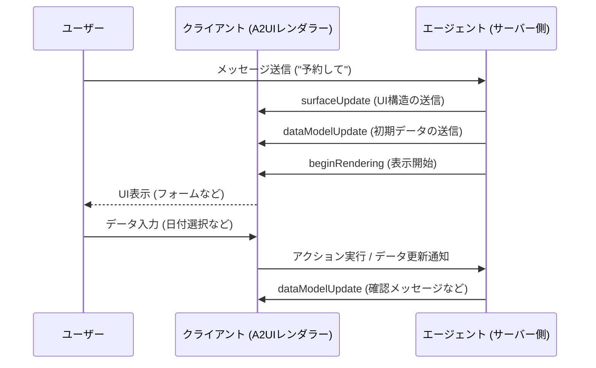

# データフロー

A2UIにおけるデータフローは、エージェントがUIを生成し、クライアントがそれを表示し、ユーザーが対話してエージェントにフィードバックを送るという一連の流れを定義します。

## 基本的な流れ



## 1. サーバーからクライアントへのフロー

エージェント（サーバー）は、JSON形式のメッセージをクライアントに送信します。

1. **UIの記述**: `surfaceUpdate` メッセージで、どのコンポーネントを表示するかを記述します。
2. **データの提供**: `dataModelUpdate` メッセージで、バインドされたプロパティに使用されるデータを提供します。
3. **レンダリングのトリガー**: `beginRendering` メッセージで、クライアントに描画の準備ができたことを知らせます。

### ストリーミング

A2UIはストリーミングに最適化されています。エージェントはUI全体が完成するのを待たずに、生成されたメッセージを1つずつ送信できます。クライアントはこれを受信した順に処理し、インクリメンタルにUIを構築します。

## 2. クライアントからサーバーへのフロー (ユーザーアクション)

ユーザーがUIを操作すると、それに応じたデータがエージェントに送り返されます。

### アクションの実行
ユーザーがボタンをクリックすると、定義された `action` がサーバーに送信されます。

```json
{
  "action": {
    "name": "confirm_booking",
    "parameters": {
      "selection": "option_1"
    }
  }
}
```

### ステート（状態）の同期
`TextField` などの入力コンポーネントでデータが変更されると、それに応じたパスのデータがサーバーと同期されます。

## ライフサイクル

1. **定義 (Define)**: `surfaceUpdate` による構造の定義。
2. **初期化 (Initialize)**: `dataModelUpdate` によるデータの初期化。
3. **表示 (Show)**: `beginRendering` による表示開始。
4. **対話 (Interact)**: ユーザーによるアクションや入力の反映。
5. **更新 (Update)**: エージェントによる追加のデータや構造の変更。
6. **破棄 (Destroy)**: `deleteSurface` によるUIの削除。

## 次のステップ

- **[メッセージリファレンス](../reference/messages.md)**：送信される各メッセージの仕様
- **[トランスポート層](../transports.md)**：メッセージを配信するためのメカニズム
- **[エージェント開発ガイド](../guides/agent-development.md)**：フローを実装するためのガイド
