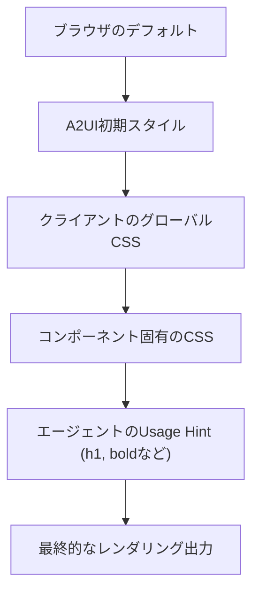

# テーマ設定ガイド

A2UIは「ヘッドレス (Headless)」であることを念頭に置いて設計されています。エージェントはUIの構造とデータを送信しますが、最終的な見た目（色、フォント、間隔など）はクライアントアプリケーションが所有するデザインシステムによって決定されます。

## テーマ設定のレベル

A2UIのテーマ設定には、主に3つのレベルがあります：

### 1. グローバルテーマ (CSS Variables)

色やタイポグラフィの基本設定を変更します。

```css
:root {
  /* プライマリカラー設定 */
  --a2ui-color-primary: #1a73e8;
  --a2ui-color-on-primary: #ffffff;
  
  /* フォント設定 */
  --a2ui-font-family: 'Roboto', sans-serif;
  
  /* 形状と間隔 */
  --a2ui-border-radius: 8px;
  --a2ui-spacing-unit: 4px;
}
```

### 2. コンポーネント固有のスタイル

特定のコンポーネントの見た目を微調整します。

```css
a2ui-button {
  --a2ui-button-padding: 12px 24px;
  --a2ui-button-font-weight: 500;
}
```

### 3. 使用ヒント (Usage Hints)

エージェントが、コンポーネントがどのように使われるべきかについてヒントを出すことができます。

```json
{
  "id": "title-1",
  "component": {
    "Text": {
      "text": {"literalString": "重要な通知"},
      "usageHint": "h1" 
    }
  }
}
```

## A2UIテーマ変数の体系

| カテゴリ | 変数プレフィックス | 説明 |
| :--- | :--- | :--- |
| **Colors** | `--a2ui-color-*` | 背景色、前景色、アクセントカラー、エラーカラーなど |
| **Typography** | `--a2ui-font-*` | フォントファミリー、サイズ、太さ、行間など |
| **Shape** | `--a2ui-border-*` | 角の丸み、外枠の太さなど |
| **Spacing** | `--a2ui-spacing-*` | パディング、マージン、グリッドの間隔など |

## ダークモードのサポート

標準のCSSメディアクエリやクラスを使用して、ダークモードを簡単にサポートできます。

```css
@media (prefers-color-scheme: dark) {
  :root {
    --a2ui-color-surface: #121212;
    --a2ui-color-on-surface: #e0e0e0;
  }
}
```

## テーマ設定のフロー

A2UIにおいて、スタイルがどのように決定されるかの優先順位は以下の通りです：



## ベストプラクティス

- **デザイントークンの活用**: アプリケーションですでに使用しているデザイントークンをA2UIの変数にマッピングしてください。
- **Usage Hintの尊重**: エージェントが出した意図（「これは見出しである」など）を尊重しつつ、スタイルはアプリに従わせてください。
- **一貫性の維持**: A2UIで生成されたUIが、アプリ内の他の手動で作成されたUIと区別がつかないようにすることが理想です。

## 次のステップ

- **[クライアント設定ガイド](client-setup.md)**：レンダラーの組み込み
- **[カスタムコンポーネントガイド](custom-components.md)**：独自のスタイリングを持つコンポーネントの作成
