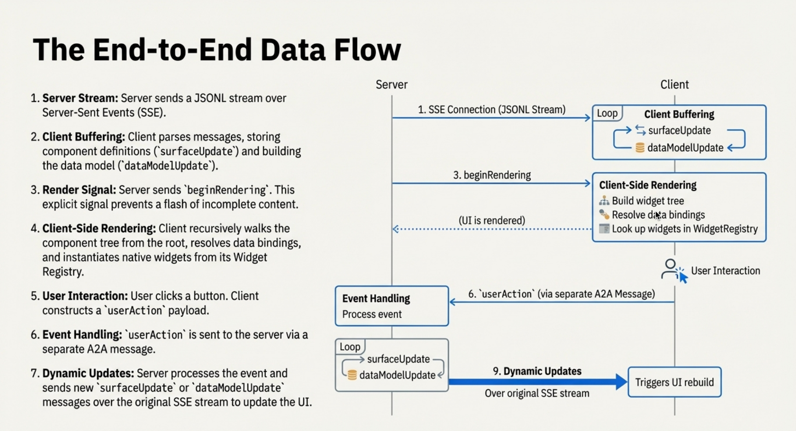

---
hide:
  - toc
---

<!-- markdownlint-disable MD041 -->
<!-- markdownlint-disable MD033 -->

<!-- Logo for Light Mode (shows dark logo on light background) -->

<!-- Logo for Dark Mode (shows light logo on dark background) -->

# エージェント主導インターフェースのためのプロトコル

A2UIは、AIエージェントが任意のコードを実行することなく、Web、モバイル、デスクトップでネイティブにレンダリングされるリッチでインタラクティブなユーザーインターフェースを生成できるようにします。

## 仕様バージョン

| バージョン | ステータス | 説明 |
|---------|--------|-------------|
| **[v0.8](specification/v0.8-a2ui.md)** | **安定版** | 現在の本番向けリリースです。サーフェス、コンポーネント、データバインディング、隣接リストモデルを含みます。 |
| **[v0.9](specification/v0.9-a2ui.md)** | **草案** | `createSurface`、クライアント側関数、カスタムカタログ、および拡張仕様を追加します。 [進化ガイド →](specification/v0.9-evolution-guide.md) |

CopilotKit とオープンソースコミュニティの貢献を受けながら、A2UI は Google によって提供されており、[GitHub](https://github.com/google/A2UI) で活発に開発されています。

A2UI が解決する問題は、**AI エージェントが信頼境界をまたいで、どのように安全にリッチな UI を送信できるか** です。

テキストだけの応答や危険なコード実行の代わりに、A2UI はエージェントが **宣言的なコンポーネント記述** を送信できるようにします。クライアントはそれを自前のネイティブウィジェットでレンダリングします。つまり、エージェントが共通の UI 言語を話しているようなものです。

このリポジトリには以下が含まれます。

- [A2UI 仕様](specification/v0.8-a2ui.md)（v0.8 安定版、v0.9 草案）
- クライアント側の [レンダラー](reference/renderers.md) 実装（Angular、Flutter、Lit など）
- エージェントとクライアントの間で A2UI メッセージを運ぶ [トランスポート](concepts/transports.md)（A2A など）

- :material-shield-check: **設計段階から安全**

    ---

    実行可能コードではなく宣言的データ形式です。エージェントは、カタログに登録された事前承認済みコンポーネントだけを要求できます。

- :material-rocket-launch: **LLM に優しい**

    ---

    フラットでストリーミングしやすい JSON 構造です。LLM は、完璧な JSON を一度に出力しなくても、UI を段階的に組み立てられます。

- :material-devices: **フレームワーク非依存**

    ---

    1 つのエージェント応答をどこでも使えます。同じ UI を Angular、Flutter、React、ネイティブモバイルで、それぞれの見た目に合わせたコンポーネントとしてレンダリングできます。

- :material-chart-timeline: **段階的レンダリング**

    ---

    生成された UI 更新をそのままストリーミングできます。ユーザーは応答の完了を待たずに、インターフェースがリアルタイムに組み上がる様子を確認できます。

## 5 分で始める

- :material-clock-fast:{ .lg .middle } **[クイックスタート](quickstart.md)**

    ---

    レストラン検索デモを実行して、Gemini ベースのエージェントと動作する A2UI を確認します。

    [:octicons-arrow-right-24: 始める](quickstart.md)

- :material-book-open-variant:{ .lg .middle } **[コアコンセプト](concepts/overview.md)**

    ---

    サーフェス、コンポーネント、データバインディング、隣接リストモデルを理解します。

    [:octicons-arrow-right-24: コンセプトを学ぶ](concepts/overview.md)

- :material-code-braces:{ .lg .middle } **[開発ガイド](guides/client-setup.md)**

    ---

    A2UI レンダラーをアプリに統合するか、UI を生成するエージェントを構築します。

    [:octicons-arrow-right-24: 開発を始める](guides/client-setup.md)

- :material-file-document:{ .lg .middle } **プロトコル仕様**

    ---

    完全な技術仕様を確認できます。[v0.8（安定版）](specification/v0.8-a2ui.md) と [v0.9（草案）](specification/v0.9-a2ui.md) を掲載しています。

    [:octicons-arrow-right-24: v0.8 仕様を読む](specification/v0.8-a2ui.md)

## 仕組み

1. **ユーザー** が AI エージェントにメッセージを送ります。
2. **エージェント** が UI を記述する A2UI メッセージ（構造 + データ）を生成します。
3. **メッセージ** がクライアントアプリケーションへストリーミングされます。
4. **クライアント** が Angular、Flutter、React などのネイティブコンポーネントでレンダリングします。
5. **ユーザー** が UI と対話し、アクションをエージェントへ返します。
6. **エージェント** が更新済みの A2UI メッセージで応答します。

## 実例

### ランドスケープアーキテクトのデモ

  

    <video width="100%" height="auto" controls playsinline style="display: block; aspect-ratio: 16/9; object-fit: cover;">
      <source src="assets/landscape-architect-demo.mp4" type="video/mp4">
      ブラウザがビデオタグをサポートしていません。
    </video>
  

  

    エージェントがランドスケープアーキテクト向けアプリケーションのインターフェース全体を生成する様子をご覧ください。ユーザーが写真をアップロードすると、エージェントは Gemini を使って内容を理解し、ランドスケープ要件に合わせたフォームを生成します。
  

### カスタムコンポーネント：インタラクティブなチャートとマップ

  

    <video width="100%" height="auto" controls playsinline style="display: block; aspect-ratio: 16/9; object-fit: cover;">
      <source src="assets/a2ui-custom-component.mp4" type="video/mp4">
      ブラウザがビデオタグをサポートしていません。
    </video>
  

  

    エージェントが数値の要約に答えるためにチャートコンポーネントを選び、その後で場所に関する質問に答えるために Google マップコンポーネントを選ぶ様子をご覧ください。どちらもクライアントが提供するカスタムコンポーネントです。
  

### A2UI Composer

CopilotKit が公開している [A2UI Widget Builder](https://go.copilotkit.ai/A2UI-widget-builder) もお試しください。

