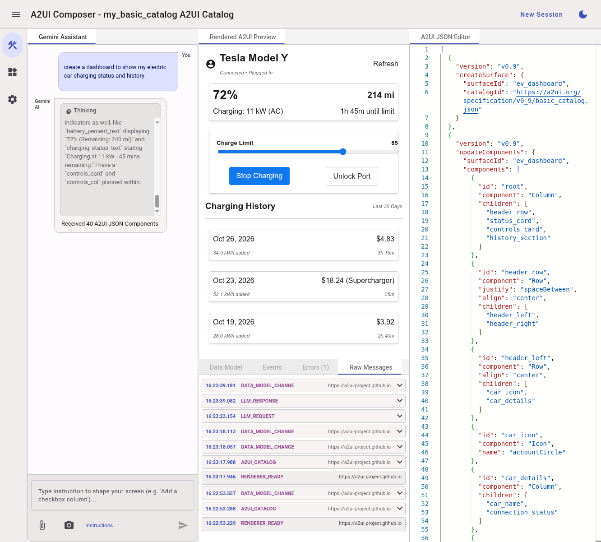
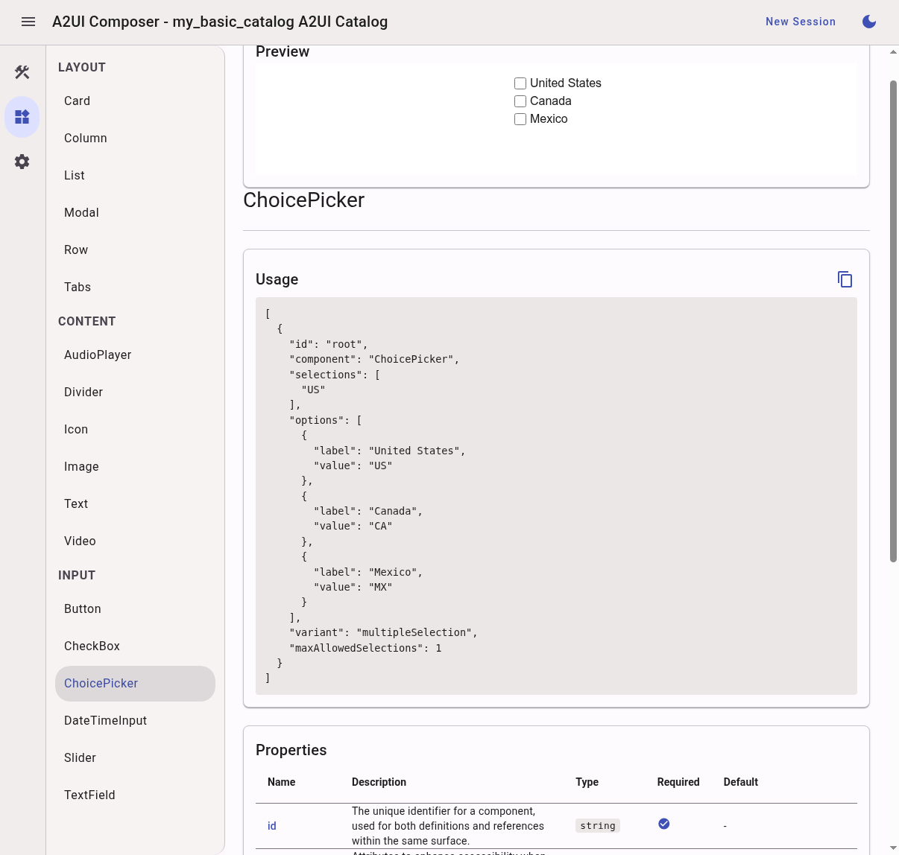

# A2UI Composer

**A2UI Composer** を使って、A2UI ウィジェットをインタラクティブに作ってみましょう。

1. [A2UI Composer](https://a2ui-project.github.io/composer/) を開きます。

2. デフォルトでは、Angular ベースのレンダラーが提供する Basic カタログが使われます。

3. Gemini チャットを使って A2UI インターフェースを作り始めましょう！
   (**注**: Gemini API キーが必要です。[下記](#gemini-api)を参照してください。)

## Composer UI の使い方

Composer のワークスペースは、A2UI サーフェスの開発とデバッグを支援するために、
複数のインタラクティブなパネルに分かれています。

- **Gemini アシスタント:** Gemini を利用したチャットインターフェースです。
  自然言語のプロンプトで、新しいレイアウトの生成、既存 JSON の調整、
  ビジュアル属性の変更などを Gemini に依頼できます。
- クリップアイコン
  {style="width:30px;height:30px;display:inline;vertical-align:middle;"}
  をクリックすると、**添付ファイル**（モックなど）をアップロードできます。
- カメラアイコン
  {style="width:30px;height:30px;display:inline;vertical-align:middle;"}
  をクリックすると、現在の A2UI インターフェースの**スクリーンショットを添付**できます。

- **レンダリングされた A2UI プレビュー:** 現在のコンポーネントのビジュアルプレビューを
  リアルタイムに表示します。

- **A2UI JSON エディター:** UI の構造とコンポーネント階層を定義する生の JSON
  ペイロードを表示します。ここを直接編集すると、プレビューが即座に更新されます。
- エディターには**[ホバー時のツールチップ](../assets/composer_editor_tooltip.png)**があり、
  該当する A2UI 要素の説明が表示されます。
- 他のソースから取得した A2UI JSON がある場合は、このパネルに貼り付けられます。
  右クリックして JSON をフォーマットすることもできます。

- **デバッグ・検査タブ（下部）:**
    - **Data Model:** UI コンポーネントにバインドされたランタイムの状態・データ値を
      検査・変更します。ここでの変更はプレビューに反映され、プレビュー上での
      ユーザー入力はこのモデルに反映されます。
    - **Events:** レンダリングされたコンポーネントが発行したユーザー操作イベント
      （クリック、入力、選択など）を記録します。
    - **Errors:** レンダリング、JSON のパース、API の失敗によるエラーを表示します。
    - **Raw Messages:** Composer とレンダラー間の通信に加え、Gemini とのやり取りも
      表示します。（詳細は[下記](#raw-messages)を参照してください。）

## コンポーネントギャラリー

コンポーネントギャラリーでは、現在の A2UI カタログが提供するすべてのコンポーネントを
閲覧できます。各コンポーネントには、レンダリング例と、そのレンダリングを生成する
A2UI JSON が用意されています。Usage パネル上部のコピーアイコン
{style="width:30px;height:30px;display:inline;vertical-align:middle;"}
を使うと、そのコンポーネントの A2UI JSON 全体をコピーできます。

ページ下部には、コンポーネントのすべてのプロパティを説明・型・必須かどうかとともに
一覧表示した表があります。

## 設定

### レンダラーアプリケーション

設定ページでは、使用するレンダラーアプリケーションを変更できます。現時点では、
3 つのレンダラーアプリケーションがプリロードされています。

- Angular Basic Catalog
- Lit Basic Catalog
- React Basic Catalog

別のレンダラーアプリを開発している場合は、ドロップダウンから "Custom" を選択し、
テキストボックスに URL を入力してください。（レンダラーアプリの作り方は
[A2UI Composer 連携](./composer_renderer_integration.md)を参照してください。）

### Gemini API キー {#gemini-api}

このページでは Gemini API キーを入力でき、Gemini チャット機能を利用できるようになります。

API キーを取得するには、次の手順に従います。

1. [Google AI Studio](https://aistudio.google.com/api-keys) にアクセスし、Google
   アカウントでログインします。
2. Create API key をクリックします。
3. プロンプトに従って Google Cloud プロジェクトを選択または作成し、Create key を
   クリックします。
4. 取得したキーは安全な場所に保管してください！

なお、A2UI Composer はこのキーを暗号化し、
[Web Crypto API](https://developer.mozilla.org/ja/docs/Web/API/Web_Crypto_API)
を使ってブラウザのセキュアなデータベースにローカル保存します。Google を含め、
誰もこのキーにアクセスすることはできません。

## 進行中の作業

A2UI チームは、次の改善に積極的に取り組んでいます。

- **レイテンシの削減:** Gemini を用いたワークフローのレイテンシを改善します。
- **視覚的な理解:** すでにレンダリングされたサーフェスに対する視覚的な理解を
  高めるよう、Gemini を用いたワークフローを改善します。

## Raw Messages

Composer とレンダラーの間でやり取りされるメッセージは、トラブルシューティングや、
内部で何が起きているのかを理解するのに役立ちます。これらのメッセージには次のものが
含まれます。

- **RENDERER_READY**: レンダラーのブートストラップが完全に完了した時点で送信されます。
- **A2UI_CATALOG**: （Composer からの要求に応じて）レンダラーが送信します。
  レンダラーがサポートする A2UI カタログ全体が含まれます。
- **COMPONENT_USAGES**: （Composer からの要求に応じて）レンダラーが送信し、
  コンポーネントギャラリーページを構成するためのデータが含まれます。

A2UI コンポーネントのデータモデルに変更があるたびに **DATA_MODEL_CHANGE** メッセージが
記録され、エージェントに返送される `updateDataModel` メッセージが表示されます。

さらに、Gemini チャット機能を使用している場合は次のメッセージも確認できます。

- **LLM_REQUEST**: LLM に送信されたリクエスト全体（システムプロンプトを含む）を表示します。
- **LLM_RESPONSE**: LLM から受信したレスポンス全体を表示します。
