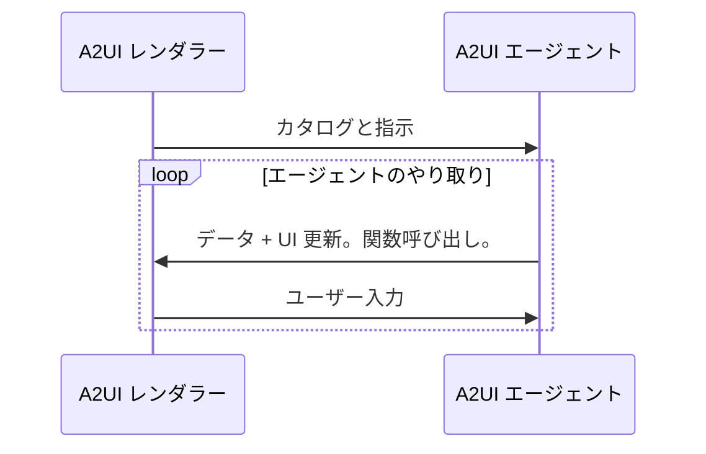
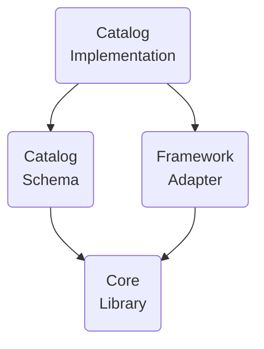

# 用語集

## A2UI プロトコル用語

A2UI プロトコルで必要になる用語です。

### A2UI エージェントと A2UI レンダラー

A2UI プロトコルは、**エージェント**と**レンダラー**の間の会話を可能にします。

1. **レンダラー**は、A2UI カタログ形式の **UI 機能**と、それを使う方法の**指示**を提供します。
2. **エージェント**は次のループを繰り返します。
    - 受け取ったカタログを考慮しながら、呼び出す **UI** と **関数**を提供します。
    - レンダラーから伝達された**ユーザー入力**を受け取ります。
    - UI に表示する**データ**を更新します。

このプロトコルは **AI を活用するエージェント**向けに設計されていますが、決定論的なエージェントでも動作します。たとえば、エージェントが事前に用意された A2UI UI を返すこともできます。

エージェントが stateless である、またはカタログの保持を保証しない場合、レンダラーはすべてのメッセージでカタログを提供する必要があります。

また、エージェントが事前定義されたカタログを使う場合もあります。その場合、レンダラーはそのカタログをサポートするか、アダプターを使う必要があります。

### GenUI コンポーネント

エージェントが使用することを許可された UI コンポーネントです。例: date picker、carousel、button、hotel selector。

### Catalog

1. レンダラー機能を項目化したものです。
    - エージェントが UI を生成するために使用できるコンポーネントの一覧
    - レンダラーが呼び出せる関数の一覧
    - スタイルとテーマ
2. レンダラー機能をどのように使うべきかの説明です。

ユースケースによって、カタログコンポーネントはドメインに対してより汎用的にも、より特化したものにもなります。

- **特化度が低いもの**:

    ボタン、ラベル、行、列、オプション選択などの基本的な UI プリミティブ。

- **特化度が高いもの**:

    `HotelCheckout` や `FlightSelector` のようなコンポーネント。

### Basic Catalog

A2UI をすばやく使い始めるために A2UI チームが管理しているカタログです。

[basic catalog](../specification/v1_0/catalogs/basic/catalog.json) を参照してください。

### Surface

A2UI エージェントによって構築され、A2UI レンダラーによって管理される UI 領域です。複数のコンポーネントで構成されます。Surface はネストできません。

### エージェントアーキテクチャ

A2UI エージェントにはいくつかの選択肢があります。

- **同一プロセスまたはサーバー側**:

    エージェントとレンダラーが、クライアント側アプリケーションの 1 つのプロセス内に存在することがあります。例: デスクトップ Flutter アプリケーション。

    または、レンダラーが UI を表示するマシンにあり、エージェントが別のマシン(サーバー)にあることもあります。

- **オーケストレーターエージェント**:

    中央のオーケストレーターが、ユーザーと複数の専門 sub-agent の間の相互作用を管理します。オーケストレーターは同一プロセス内にもサーバー上にも置けます。

- **Pulling / pushing**:

    エージェントはレンダラーからのメッセージ/リクエストを待つことも、レンダラーへメッセージ/リクエストを push することもできます。

- **Stateful / stateless**:

    エージェントは状態を保持することも、stateless にすることもできます。

- **他のプロトコルとの混在**:

    A2UI は他のプロトコルと組み合わせて使えます。たとえば、エージェントが MCP サーバーや A2A サーバーである場合があります。

- **その他**:

    上記以外にも、任意のカスタムバリエーションが可能です。

### レンダラースタック

A2UI レンダラーの機能は、別々に開発して再利用できるレイヤーで構成されます。

- **Core Library**:

    カタログを記述し、エージェントとやり取りするために必要な primitive の集合です。

    例として [JavaScript web core library](../../../renderers/web_core/README.md) を参照してください。

- **Catalog Schema**:

    JSON 形式のカタログ定義です。

    例として [basic catalog schema](../specification/v1_0/catalogs/basic/catalog.json) を参照してください。

- **Framework adapter**:

    具体的なフレームワークでエージェントの指示を実行するコードです。例:
    - JavaScript core と catalog は Angular、Electron、React、Lit フレームワークに適合させることができます。
    - Dart core と catalog は Flutter や Jaspr フレームワークに適合させることができます。

    [Angular adapter](../../../renderers/angular/README.md) を参照してください。

- **Catalog Implementation**:

    フレームワーク向けのカタログスキーマ実装です。

    例:
    - [Angular implementation of the basic catalog](../../../renderers/angular/src/v0_9/catalog/basic) を参照してください。

### A2UI メッセージ

エージェントとレンダラーの間のメッセージです。

このプロトコルはストリーミングを許可するため、任意のメッセージは完了済み(完全に配送済み)または未完了(部分的に配送済み)になり得ます。完了済みメッセージは、正常に配送されて完了したものか、技術的な問題で配送が止まった interrupted のいずれかです。

[data flow guide](data-flow.md) を参照してください。

### エージェントターン

エージェントがユーザー入力を待ち始める前に送信するメッセージの集合です。

### データモデル

レンダラーとエージェントの間で共有され、双方から更新可能な、観察可能で階層的な JSON 風オブジェクトです。各 Surface は別個の Data Model を持ちます。

コンポーネントはデータモデルのノードにバインドでき、値が変更されると自動的に更新されます。

データモデルは、ユーザー操作を状態オブジェクトとしてキャプチャしてエージェントへ送信しつつ、エージェントがデータ更新を UI へ push できるようにすることで、双方向同期を可能にします。

[data binding guide](data-binding.md) を参照してください。

### データ参照

コンポーネント定義内でのデータ要素への参照です。データモデル内の path または値として解決できます。

[basic catalog の例](../specification/v1_0/catalogs/basic/catalog.json#L18) を参照してください。

### クライアント関数

必要に応じてエージェントが呼び出せるように提供される関数です。

LLM tool と混同しないでください。

| Feature      | Client Function                                                       | LLM Tool Invocation                                                                   |
| ------------ | --------------------------------------------------------------------- | ------------------------------------------------------------------------------------- |
| Executor     | A2UI Renderer                                                         | LLM が実行の詳細を気にせず呼び出しを要求します。                                      |
| Timing       | エージェントからレンダラーへのメッセージが送信された後です。          | エージェントからレンダラーへのメッセージが送信される前です。                          |
| Purpose      | UI ロジック(検証、表示切り替え、フォーマット)                         | 推論、データ取得、バックエンドアクション                                               |
| Definition   | クライアント側関数レジストリに登録され、カタログで通知されます。      | ToolDefinition に定義されます(LLM に渡されます)。                                     |
| State Access | DataContext と Input 値にアクセスします。                             | AI へのリクエストをトリガーできません。外部 API、データベース、サービスへアクセスします。 |

[common types の例](../specification/v0_9/json/common_types.json#L200) を参照してください。

### Action

UI でユーザーがトリガーした相互作用を格納するコンテナです。Action には 2 種類あります。

- **Event**: 処理のためにエージェントへ dispatch されます(例: "Submit" のクリック)。
- **Function**: レンダラー上でローカル実行されます(例: URL を開く)。

[actions の詳細ガイド](actions.md) を参照してください。

## 生成 UI 用語

A2UI プロトコルでは必須ではありませんが、生成 UI の文脈でよく使われる用語です。

### GenUI の既知パターン

- **Chat**:

    生成された UI の断片が時間順に 1 つずつ現れ、ユーザー入力と混ざって縦スクロール領域に表示されます。

- **Canvas**:

    エージェントと共同作業するための空間です。

- **Dashboard**:

    生成された UI の断片が時間順ではなく意味に基づいて整理され、ユーザーが期待する場所に安定して(pinned とも呼ばれる)留まります。

- **Wizard**:

    特定のタスクに必要な情報を集めることを目的として、生成された UI の断片が 1 つずつ表示されます。

### NoAI 情報

**AI がアクセスできない情報**として分類された情報です。例: クレジットカード情報。

どの情報を AI からアクセス不可にするかはアプリケーションの所有者が定義し、**文脈によって異なります**。たとえば、ある文脈では病歴を AI に送ってはならない一方で、別の文脈では医療診断を支援するために AI が多用され、病歴が必要になることがあります。

この用語は GenUI の文脈で重要です。エンドユーザーは、自分の入力のうち何が AI に渡されてよいのか、何が許可されないのかを**明確に見たい**からです。
