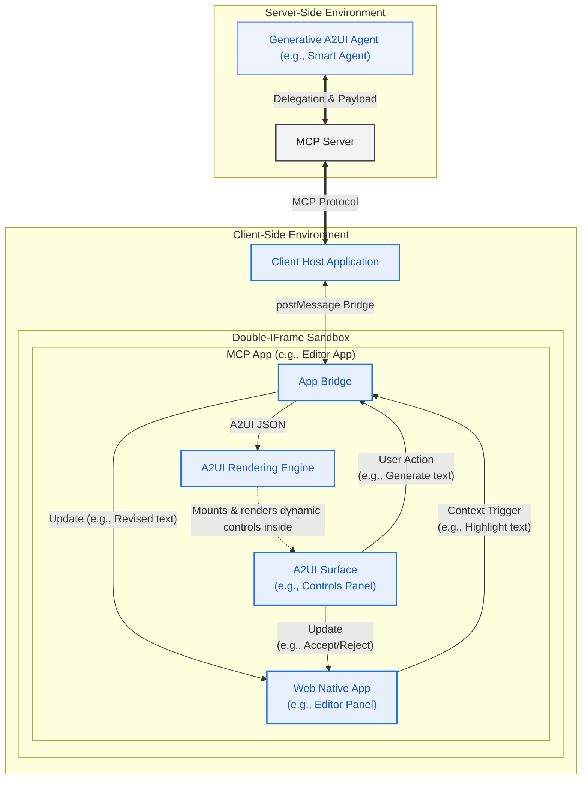
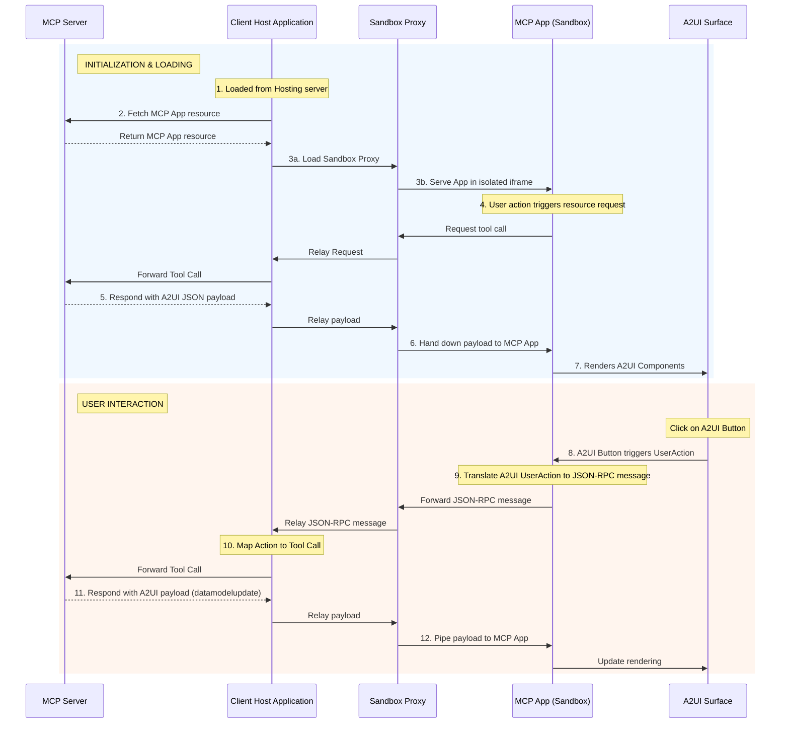

# MCP Application 内での A2UI 動的レンダリング

このガイドでは、Tools と Embedded Resources を使って [MCP Apps](https://modelcontextprotocol.io/extensions/apps/overview) 内でリッチでインタラクティブな A2UI インターフェースを提供する方法を示します。最後まで進めると、A2UI コンポーネントをレンダリングし、A2UI の相互作用を処理できる MCP App を返す MCP server が動作するようになります。MCP Apps 内で native A2UI をサポートすることで、MCP server は UI スタイルの一貫性を保ちながら、リモートエージェントと安全に協調できます。


## 前提条件

- **[Python 3.10+](https://www.python.org/)**
- **[uv](https://docs.astral.sh/uv/)** — 高速な Python パッケージマネージャー
- **[Node.js 18+](https://nodejs.org/)** (MCP Inspector 用)

## Quick Start: サンプルを実行する

このサンプルを実行する詳しい手順は、[README.md](https://github.com/a2ui-project/a2ui/blob/main/samples/community/mcp/a2ui-in-mcpapps/README.md) を参照してください。

## アーキテクチャ概要

このシステムは、通信チェーンを通じて相互作用する 3 つの主要 actor で構成されます。

1.  **クライアントホストアプリケーション**: MCP Server に接続し、MCP App の安全な sandbox を host する外側のコンテナです(例: Angular app)。
2.  **MCP Application (Sandboxed)**: double-iframe sandbox 内で動作する、信頼されないサードパーティ Web アプリケーションです(例: Lit または Angular micro-app)。この app には A2UI surface が含まれます。
3.  **MCP Server**: アプリケーションリソースを提供し、tool call を処理する backend server です。



## 深掘り: 通信フロー

このパターンの重要な点は、**MCP App** が A2UI payload を直接レンダリングすることです。Client Host Application にレンダリングを任せません。

### MCP Apps で A2UI コンポーネントを読み込む

MCP Apps に A2UI コンポーネントを動的に読み込むイベントの流れは次のとおりです。

1.  **Trigger**: MCP App が UI コンテンツを取得または更新する必要があると判断します(例: 初期化時、またはユーザー起点の Action)。
2.  **Request**: MCP App が `window.parent.postMessage` を通じて Host に JSON-RPC リクエストを送ります。
    - _Example Method_: `ui/fetch_counter_a2ui`
3.  **Relay**: Sandbox Proxy がこのメッセージを Client Host に relay します。
4.  **MCP Call**: Client Host がこの custom message を、MCP Server への標準 MCP `tools/call` リクエストに変換します。
    - _Example Tool_: `fetch_counter_a2ui`
5.  **Response**: MCP Server が tool を実行し、`application/a2ui+json` resource を含む result を返します。
6.  **レスポンス転送**: Host が tool result を受け取り、Sandbox Proxy を通じて MCP App へ戻します。
7.  **レンダリング**: MCP App が resource から A2UI JSON payload を抽出し、ローカル A2UI `MessageProcessor` に渡して A2UI surface を動的に更新します。

### ユーザーアクションの処理

レンダリングされた A2UI surface 内の相互作用は、流れを逆向きにして処理されます。

1.  ユーザーが MCP App 内の A2UI surface でボタンをクリックします。
2.  A2UI コンポーネントが `userAction` をトリガーします。
3.  MCP App が A2UI `MessageProcessor.events` の購読を通じてこの event をキャプチャします。
4.  MCP App が action をパッケージし、JSON-RPC メッセージとして Host に送ります(例: `ui/increase_counter`)。
5.  Host が MCP Server 上の対応する tool を呼び出します。
6.  Server が更新後の状態を表す新しい A2UI payload を返し、それが MCP App へ pipe されてレンダリングを更新します。

### Sequence Diagram



## 実装方法

A2UI 機能を持つ独自 MCP App を構築するには、次の手順に従います。

### Step 1: レンダラーをインライン化する

MCP Apps は通常、MCP Server から単一の HTML resource として配信されます。Angular や React のようなモダンフレームワークでこれを実現するには、次を行います。

1.  アプリケーションを通常どおりビルドし、static assets(`index.html`, `.js`, `.css`)を生成します。
2.  サンプルの [`inline.js`](https://github.com/a2ui-project/a2ui/blob/main/samples/community/mcp/a2ui-in-mcpapps/server/apps/src/inline.js) のような post-build script を使い、`index.html` を読み取って、外部の `<script src="...">` と `<link rel="stylesheet" href="...">` タグを、実際のファイル内容を含む inline `<script>` と `<style>` タグへ置き換えます。
3.  制限付き iframe で `srcdoc` により安全に読み込める self-contained HTML ファイルが生成されます。

> [!TIP]
> **Vite で inline 化する**
>
> プロジェクトが Vite を使っている場合(React、Vue、Lit で一般的)、`vite-plugin-singlefile` のようなプラグインを使って同じ single-file 出力を自動化できます。これにより、ビルド中に inline 化が処理されるため、custom post-build script は不要になります。
>
> **使い方:**
>
> 1. **プラグインをインストール**:
>     ```bash
>     npm install -D vite-plugin-singlefile
>     ```
> 2. **Vite を設定**: `vite.config.ts`(または `.js`)にプラグインを追加します。
>
>     ```typescript
>     import {defineConfig} from 'vite';
>     import {viteSingleFile} from 'vite-plugin-singlefile';
>
>     export default defineConfig({
>       plugins: [viteSingleFile()],
>     });
>     ```
>
>     これにより、ビルド時にすべての JS と CSS assets が `index.html` ファイルへ inline 化され、MCP server から単一 resource として提供できる状態になります。

### Step 2: A2UI-over-MCP を活用する

インライン化された app は sandbox 内で実行されています。A2UI を活用するには、次を行います。

1.  app bundle に **A2UI Angular/Lit ライブラリ**を含めます。
2.  MCP Server とやり取りするため、Host との**通信契約**を定義します。
3.  Host から応答を受け取ったら、content 内の `application/a2ui+json` mimeType を探します。
4.  JSON text をパースし、A2UI [`MessageProcessor`](https://github.com/a2ui-project/a2ui/blob/main/renderers/angular/src/v0_8/data/processor.ts) に渡します。

**例: A2UI の取得とレンダリング**

```typescript
// 1. Request A2UI data from Host
const result = await callHostMethod('ui/fetch_counter_a2ui');

// 2. Find and parse the A2UI resource
const a2uiResource = result.find(
  c => c.type === 'resource' && (c.resource?.mimeType === 'application/a2ui+json' || c.resource?.mimeType === 'application/json+a2ui'),
);

if (a2uiResource?.resource?.text) {
  const messages = JSON.parse(a2uiResource.resource.text);
  this.processor.processMessages(messages);
}

// Utility for JSON-RPC communication
function callHostMethod(method: string, params: any = {}): Promise<any> {
  return new Promise((resolve, reject) => {
    const requestId = `${method}-${Date.now()}`;

    const handler = (event: MessageEvent) => {
      if (event.data.id !== requestId) return;
      window.removeEventListener('message', handler);

      if (event.data.error) {
        reject(event.data.error);
      } else {
        resolve(event.data.result);
      }
    };

    window.addEventListener('message', handler);

    window.parent.postMessage(
      {
        jsonrpc: '2.0',
        id: requestId,
        method,
        params,
      },
      '*',
    ); // Note: Replace "*" with explicit target origin in production
  });
}
```

### Step 3: A2UI コンポーネントのユーザーアクションを処理する

レンダリングされた A2UI surface 内の相互作用を処理するには、MCP App が A2UI event をキャプチャし、JSON-RPC を使って Host へ転送する必要があります。

**例: ユーザーアクションの処理**

```typescript
// Subscribing to A2UI events in the MCP App ([main.ts](https://github.com/a2ui-project/a2ui/blob/main/samples/community/mcp/a2ui-in-mcpapps/server/apps/src/src/main.ts))
this.processor.events.subscribe(async event => {
  if (!event.message.userAction) return;

  const method = `ui/${event.message.userAction.name}`;
  const params = event.message.userAction.context;

  try {
    // Translate A2UI UserAction to JSON-RPC, send to Host, and await response
    const result = await callHostMethod(method, params);

    // Parse the updated A2UI payload and update the rendering
    const messages = extractA2UIMessages(result);
    if (messages) {
      this.processor.processMessages(messages);
    }
  } catch (error) {
    console.error(`Error handling user action[${method}]:`, error);
  }
});
```

このパターンにより、MCP App は厳格なセキュリティ分離を維持しながら、MCP Server の A2UI 機能に対する動的インターフェースとして機能できます。

### Inlined MCP App HTML Pseudocode

すべてをまとめると、次はコンパイルされインライン化された MCP Application を表す HTML mockup です。native `<a2ui-surface>` 要素を持つ placeholder UI を定義し、外側の host と通信するために `AppBridge` を初期化し、読み込み時に dynamic A2UI layout を取得し、読み込まれた A2UI SDK で event を処理します。

```html
<!DOCTYPE html>
<html lang="en">
  <head>
    <meta charset="UTF-8" />
    <title>Inlined MCP App Surface</title>
    <!-- Assumes the standard A2UI SDK script is bundled or loaded -->
  </head>
  <body>
    <div>
      <h3>MCP App (Editor Panel)</h3>
      <p>This text is native to the sandboxed third-party app.</p>

      <!-- A2UI Surface custom element provided by the A2UI SDK -->
      <a2ui-surface surfaceId="recipe-card"></a2ui-surface>
    </div>

    <script>
      // Note: The pseudocode below assumes AppBridge from @modelcontextprotocol/ext-apps
      // and a2uiProcessor from the A2UI SDK are preloaded or inlined.
      const bridge = new AppBridge({name: 'editor-panel', version: '1.0.0'});

      // Helper to extract and process dynamic A2UI responses from tool results
      function processA2UIResponse(result) {
        const a2uiResource = result?.content?.find(
          c => c.type === 'resource' && (c.resource?.mimeType === 'application/a2ui+json' || c.resource?.mimeType === 'application/json+a2ui'),
        );
        if (a2uiResource?.resource?.text) {
          const payload = JSON.parse(a2uiResource.resource.text);
          window.a2uiProcessor.processMessages(payload);
        }
      }

      // 1. Initialize AppBridge and fetch initial controls
      async function initApp() {
        await bridge.connect();

        // Call server tool to load initial layout controls
        const result = await bridge.callServerTool({name: 'fetch_controls', arguments: {}});
        processA2UIResponse(result);
      }

      // 2. Handle interactive User Actions routed by the A2UI SDK
      window.a2uiProcessor.events.subscribe(async event => {
        if (!event.message.userAction) return;
        const action = event.message.userAction;

        // Route the user action directly via the bridge to the MCP Server tool
        const result = await bridge.callServerTool({
          name: action.name,
          arguments: action.context,
        });

        // Feed any updated server UI states back to the A2UI processor
        processA2UIResponse(result);
      });

      // Initialize the app on startup
      initApp();
    </script>
  </body>
</html>
```

## セキュリティ上の考慮事項

- **明示的な Target Origin**: host origin が分かっている場合、`postMessage` を呼び出すときは常に `*` ではなく具体的な target origin(例: `'https://trusted-host.com'`)を使ってください。これにより、悪意ある iframe が RPC リクエストを傍受するのを防げます。
- **Null Origin の扱い**: 厳格な sandbox(`allow-same-origin` なしの `sandbox="allow-scripts"`)内では、`window.location.origin` が `"null"` と評価されることを覚えておいてください。`event.source` を期待される window object(例: `window.parent`)と比較し、受信メッセージを慎重に検証する必要があります。
