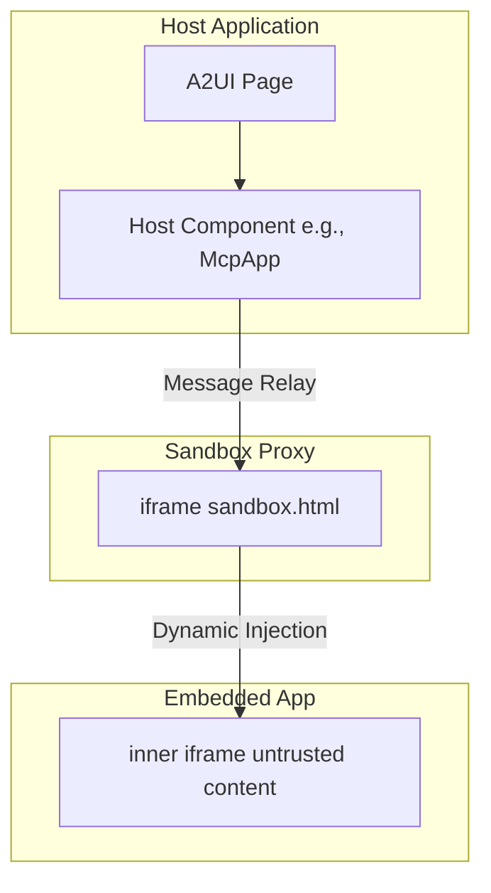
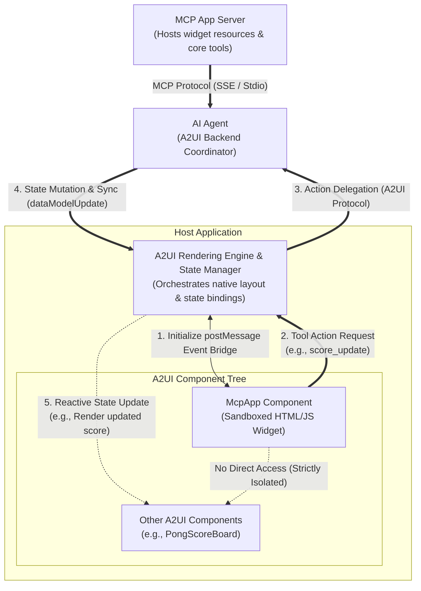
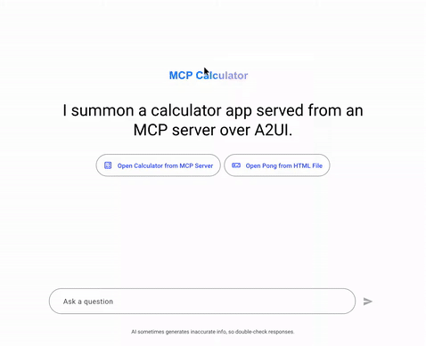

# A2UI Surface における MCP Apps 統合

このガイドでは、**Model Context Protocol (MCP) Applications** が **A2UI** surface 内にどのように統合され、表示されるかを、セキュリティモデルとテストガイドラインとともに説明します。

> NOTE: 中核となる A2UI-over-MCP プロトコルを探している場合は、MCP tool call から A2UI JSON payload を返す方法を説明した [A2UI over MCP](a2ui_over_mcp.md) を参照してください。

## 概要

Model Context Protocol(MCP) は、MCP サーバーがリッチでインタラクティブな HTML ベースのユーザーインターフェースを host に届けられるようにします。A2UI は、こうしたサードパーティアプリケーションを実行するための安全な環境を提供します。


## Double-Iframe 分離パターン

信頼できないサードパーティコードを安全に実行するために、A2UI は **double-iframe** 分離パターンを利用します。この方式は、構造化された JSON-RPC チャネルを維持しながら、raw DOM injection をメインアプリケーションから隔離します。

### セキュリティ上の理由

`allow-scripts` を使った標準的な single-iframe sandboxing は、`allow-same-origin` と組み合わせるとしばしば回避され、コンテナ化が無効化されます。`allow-scripts` と `allow-same-origin` の両方を持つ iframe は、親 DOM とプログラム的にやり取りしたり、自身の sandbox 属性を削除したりすることで sandbox を脱出できます。

これを防ぐため、A2UI はサードパーティアプリケーションが実行される inner iframe で `allow-same-origin` を厳格に除外します。

### アーキテクチャ

1.  **[Sandbox Proxy (`sandbox.html`)](https://github.com/a2ui-project/a2ui/blob/main/samples/client/shared/mcp_apps_inner_iframe/sandbox.html)**: 同一 origin から提供される中間 `iframe` です。構造化された JSON-RPC チャネルを維持しながら、raw DOM injection をメインアプリから分離します。
    - 権限: host template では **sandbox しないでください**。例: [`mcp-app.ts`](https://github.com/a2ui-project/a2ui/blob/main/samples/community/client/lit/mcp-apps-in-a2ui-sample/mcp-app.ts) または [`mcp-apps-component.ts`](https://github.com/a2ui-project/a2ui/blob/main/samples/community/client/lit/mcp-apps-in-a2ui-sample/ui/custom-components/mcp-apps-component.ts)。
    - Host origin 検証: メッセージが期待される host origin から来ていることを検証します。
2.  **Embedded App(Inner Iframe)**: 最も内側の `iframe` です。制限された権限で `srcdoc` により動的に注入されます。
    - 権限: `sandbox="allow-scripts allow-forms allow-popups allow-modals"`(`allow-same-origin` は**絶対に**含めないでください)。
    - 分離: unique origin により、`localStorage`、`sessionStorage`、`IndexedDB`、cookies へのアクセスがなくなります。

### 物理的な Iframe のネスト



### End-to-End アーキテクチャと Lifecycle Flow

完全なサイクルには、layout tree 階層、完全に分離された backend actor(Proxy Agent と MCP Server)、そして分離されたサードパーティウィジェットが native sibling(例: Pong ゲームの scoreboard)と反応的に相互作用する方法が含まれます。



#### Sibling Update Loop の仕組み

1. **postMessage イベントブリッジの初期化(1)**: host shell が double-iframe sandbox をインスタンス化し、`McpApp` コンポーネントとの安全な message relay bridge を確立します。
2. **Tool Action Request(2)**: ユーザーが sandboxed app と操作すると(例: Pong ゲームで得点する)、app は postMessage bridge 経由でメッセージを post し、tool action をトリガーします。
3. **Action Delegation(3)**: host layout engine が action をインターセプトし、A2UI/A2A プロトコルを介して `AI Proxy Agent` に実行を委任します。外部計算やリソースが必要な場合、agent は標準 MCP Protocol(SSE / Stdio)を使って `MCP App Server` と任意に連携します。
4. **状態変更と同期(4)**: agent が action を処理し、master session state を変更し、`dataModelUpdate` を host state manager へ push します。
5. **Reactive State Update(5)**: host がローカル store を更新し、その state path にバインドされた sibling A2UI コンポーネント(例: native scoreboard や display)の反応的更新をトリガーします。sandboxed コンポーネントと native sibling 要素の直接通信は、コンテナ化セキュリティを維持するため厳格にブロックされます。

## 使用方法 / コード例

MCP Apps コンポーネントは通常、A2UI カタログの `custom` ノードとして解決されます。開発者がコードで使う例を示します。

### 1. カタログ内に登録する

コンポーネントをアプリケーションカタログに登録する必要があります。たとえば Angular では次のようになります。

```typescript
import {Catalog} from '@a2ui/web_core/v0_9';
import {z} from 'zod';
import {McpApp} from './mcp-app';
import {Button} from './button';
import {Snackbar} from './snackbar';

const McpAppSchema = z.object({
  content: z.union([z.string(), z.object({id: z.string()})]).optional(),
  allowedTools: z.array(z.string()).optional(),
  title: z.string().optional(),
});

export const DEMO_CATALOG = new Catalog(
  'my_app.org/some_catalog.json',
  [
    {name: 'McpApp', component: McpApp, schema: McpAppSchema},
    {
      name: 'Button',
      component: Button,
      schema: z.object({
        label: z.string(),
        action: z.any().optional(),
      }),
    },
    {
      name: 'Snackbar',
      component: Snackbar,
      schema: z.object({
        message: z.string(),
        durationMs: z.number().default(3000),
      }),
    },
  ]
);
```

### 2. A2UI メッセージ内で使用する

Host または Agent の context で、この custom node に変換される A2UI メッセージを送信します。

```json
{
  "type": "custom",
  "name": "McpApp",
  "properties": {
    "content": "<h1>Hello, World!</h1>",
    "title": "My MCP App"
  }
}
```

content が複雑、またはエンコードが必要な場合は、URL-encoded 文字列を渡せます。

```json
{
  "type": "custom",
  "name": "McpApp",
  "properties": {
    "content": "url_encoded:%3Ch1%3EHello%2C%20World!%3C%2Fh1%3E",
    "title": "My MCP App"
  }
}
```

## 通信プロトコル

Host と embedded inner iframe の間の通信は、`postMessage` 上の構造化された JSON-RPC チャネルで行われます。

- **Events**: Host Component は proxy からの `SANDBOX_PROXY_READY_METHOD` メッセージを待ち受けます。
- **Bridging**: `AppBridge` が message relay を処理します。開発者、特に信頼されない iframe 内の MCP App Developer は、`bridge.callTool()` を使って MCP server の tool を呼び出せます。
- **The Host**: コールバックを解決します(例: 特定の resizing、Tool results)。

### 制限事項

最も内側の iframe では `allow-same-origin` が厳格に省略されるため、次の条件が適用されます。

- MCP app は `localStorage`、`sessionStorage`、`IndexedDB`、cookies を**使用できません**。各アプリケーションは unique origin で実行されます。
- parent による直接 DOM 操作はブロックされます。すべての相互作用は message passing を通じて行う必要があります。

## 前提条件

サンプルを実行するには、次がインストールされていることを確認してください。

- **Python 3.10+** — agent と MCP server backend に必要
- **[uv](https://docs.astral.sh/uv/)** — 高速な Python パッケージマネージャー(すべての Python サンプルの実行に使用)
- **Node.js 18+** と **Yarn** — この monorepo workspace 内で sample client app をビルド・実行するために必要です。
- **`GEMINI_API_KEY`** — すべての ADK ベース agent に必要。[Google AI Studio](https://aistudio.google.com/apikey) で取得できます。

> [!NOTE]
> **パッケージマネージャーの使用について**: A2UI リポジトリ内のビルトインサンプルアプリケーションを実行するには、Corepack workspaces で構成された Yarn が必要です。このリポジトリ外での通常の利用やスタンドアロンプロジェクトでは、お好みのパッケージマネージャー(npm、pnpm など)を使用してください。

> ⚠️ **環境変数の設定**: shell で `GEMINI_API_KEY` を export するか、各 agent ディレクトリに `.env` ファイルを作成できます。agent は `dotenv` を使って `.env` ファイルを自動読み込みします。
>
> ```bash
> # Option 1: Export in shell
> export GEMINI_API_KEY="your-api-key-here"
>
> # Option 2: Create .env file in the agent directory
> echo 'GEMINI_API_KEY=your-api-key-here' > .env
> ```

## サンプル

MCP Apps 統合を示す主要なサンプルは 2 つあります。各サンプルでは **複数のターミナル** が必要です。backend service ごとに 1 つ、client 用に 1 つ使用します。

---

### サンプル 1: MCP App Standalone Sample(Lit Client & ADK Agent)

このサンプルは、Lit ベース client と ADK ベース A2A agent で sandbox を検証します。

#### Step 1: Agent を起動する

別のターミナルで agent ディレクトリに移動し、agent を起動します。

```bash
cd samples/agent/adk/mcp-apps-in-a2ui-sample
uv run agent.py
```

agent は `http://localhost:8000` で実行されます。

#### Step 2: Client を起動する

新しいターミナルで client ディレクトリに移動し、dev server を起動します(Lit renderer を先にビルドする必要があります)。

```bash
cd samples/client/lit/mcp-apps-in-a2ui-sample
yarn install
yarn dev
```

client は `http://localhost:5173/` で起動します。

#### Step 3: ブラウザで開く

ブラウザを開き、`http://localhost:5173/` に移動します。MCP App を読み込む A2UI インターフェースが表示されるはずです。

**期待される結果**: sandboxed iframe 内で MCP App を読み込むページです。iframe 内の "Call Agent Tool" ボタンをクリックすると、agent が処理する action がトリガーされます。

---

### サンプル 2: MCP Apps（電卓 + Pong）（Angular クライアント + MCP Server + Proxy Agent）

このサンプルは、Angular ベース client、MCP Proxy Agent、リモート MCP Server で sandbox を検証します。**3 つ**の backend process が必要です。

#### Step 1: MCP Server(Calculator) を起動する

```bash
cd samples/community/mcp/mcp-apps-calculator/
uv run .
```

MCP server は SSE transport を使って `http://localhost:8000`(8000 番ポートが使用中の場合は別のポート、例: `uv run . --port 8001`)で起動します。

#### Step 2: MCP Apps Proxy Agent を起動する

**新しいターミナル**で次を実行します。

```bash
cd samples/community/agent/adk/mcp_app_proxy/
export GEMINI_API_KEY="your-key"  # or use a .env file
uv run .
```

proxy agent はデフォルトで `http://localhost:10006` で起動します。

#### Step 3: Angular Client をビルドして起動する

まず、**リポジトリのルートディレクトリ**で `yarn build:all` を実行し、renderer package をビルドします。

```bash
# リポジトリのルートで実行
yarn build:all
```

続いて、**新しいターミナル**で client ディレクトリに移動し、ローカルの依存関係をインストールしてアプリを起動します(sandbox iframe proxy のバンドルと開発サーバーの起動が自動的に行われます)。

```bash
# クライアントディレクトリに移動
cd samples/community/client/angular/

# ローカルの依存関係をインストール
yarn install

# アプリを起動し、sandbox をバンドルする
yarn start mcp_calculator
```

> ⚠️ **`yarn build:all` が必要です**: `yarn build:all` は Angular app が依存する A2UI renderer package をコンパイルします。`yarn start mcp_calculator` を実行すると、サーバーを起動する前に sandbox proxy が Angular プロジェクトの public assets へ自動的にバンドルされます。

client は `http://localhost:4200/` で起動します。

#### Step 4: ブラウザで開く

次へ移動します。

```
http://localhost:4200/?disable_security_self_test=true
```

**期待される結果**: calculator app または pong app を読み込む smart chip のセットがレンダリングされます。どちらの app も、それぞれの sandboxed iframe 内で実行されます。

|                                                 Calculator App                                                 |                                 Pong App                                  |
| :------------------------------------------------------------------------------------------------------------: | :-----------------------------------------------------------------------: |
|  |  |

---

## テスト用 URL オプション

テスト目的で、特定の URL query parameter を使って security self-test を opt-out できます。

### `disable_security_self_test=true`

この query parameter により、iframe 分離を検証する security self-test をバイパスできます。double-iframe 設定が厳格な origin check を通過しない可能性があるデバッグやテスト環境(例: `localhost` 開発)で便利です。

使用例:

```
http://localhost:4200/?disable_security_self_test=true
```

## トラブルシューティング

| 問題                                             | 解決方法                                                                                         |
| ------------------------------------------------ | ------------------------------------------------------------------------------------------------ |
| `GEMINI_API_KEY environment variable not set`    | キーを export するか、agent ディレクトリに `.env` ファイルを追加します。                         |
| `restaurant_finder` agent の Python version error | Python 3.13+ をインストールします(そのサンプルの `pyproject.toml` で必要)。                      |
| `yarn build:renderer` fails                      | 先に `samples/client/lit/` で `yarn install` を実行したことを確認します。                         |
| Angular client shows blank page                  | `yarn start` の前に `yarn build:sandbox` を実行したことを確認します。                             |
| MCP app iframe doesn't load                      | MCP server(port 8000) と proxy agent(port 10006) の両方が実行中であることを確認します。           |
| `ng serve` not found                             | `yarn install` を実行して、`@angular/cli` を含む dev dependency をインストールします。            |
| "URL with hostname not allowed"                  | Angular 21 は許可 host を制限します。デフォルトの `localhost` を使い、`--host 0.0.0.0` は渡さないでください。 |
| Security self-test fails in dev                  | URL に `?disable_security_self_test=true` を追加します。                                          |
