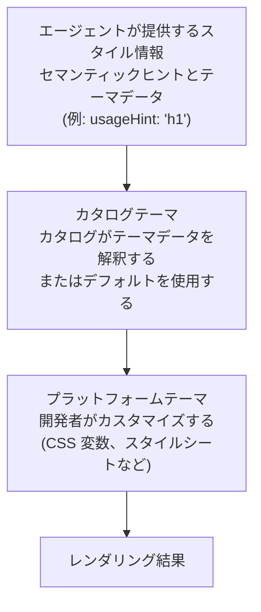

# テーマとスタイリング

ブランドに合わせて A2UI コンポーネントの見た目をカスタマイズします。

## A2UI のスタイリング思想

A2UI は、デフォルトでは **レンダラー主導のスタイリング** というアプローチに従いますが、カタログを通じて柔軟性を持たせることもできます。

- **エージェントは _何を_ 表示するかを記述します**(コンポーネントと構造)
- **レンダラーは _どのように_ 見えるかを決定します**(色、フォント、間隔)

とはいえ、このプロトコルは、必要に応じてエージェントがスタイリングに影響を与えられるだけの柔軟性を備えています。

## スタイリングのレイヤー

A2UI のスタイリングはレイヤー構造で機能します。



## エージェントが提供するスタイル情報

### セマンティックヒント

エージェントは、視覚的なスタイルではなくセマンティックヒントを提供し、レンダリングをガイドします。_basic catalog_ では次のようになります。

```json
{
  "id": "title",
  "component": {
    "Text": {
      "text": {"literalString": "Welcome"},
      "usageHint": "h1"
    }
  }
}
```

**一般的な `usageHint` の値:**

- Text: `h1`, `h2`, `h3`, `h4`, `h5`, `body`, `caption`
- 他のコンポーネントにもそれぞれ独自のヒントがあります([コンポーネントリファレンス](../reference/components.md) を参照)

カタログの要素は、これらのセマンティックヒントをターゲットプラットフォーム上の実際のコンポーネントにマッピングし、スタイルを適用します。

### `theme` プロパティ

A2UI プロトコルでは、`createSurface` メッセージに任意の `theme` プロパティを含めることができます。現時点では、このプロパティは Zod スキーマで `z.any().optional()` として定義されており、エージェントはクライアントのレンダラーとカタログが理解できる任意の JSON 構造を渡せることを意味します。

- スキーマ定義は [server-to-client.ts](../../../renderers/web_core/src/v0_9/schema/server-to-client.ts) を参照してください。
- `Catalog` クラスと `themeSchema` は [catalog/types.ts](../../../renderers/web_core/src/v0_9/catalog/types.ts) を参照してください。

**注:** _basic catalog_ のコンポーネントは、エージェントから渡される `theme` を使用するようには配線されていません。

_このデザインに意見を出したいですか? こちらからどうぞ: [#1118](https://github.com/a2ui-project/a2ui/issues/1118)。_

## カタログテーマ

テーマ設定はカタログ実装の責務です。各カタログは、望む任意のテーマ設定の仕組みを提供できます。一例として、デフォルトの _basic catalog_ は次のように行っています。

### Web Basic Catalog のテーマ設定

Web 上では、デフォルトの A2UI レンダラーが提供する _basic catalog_ は、CSS 変数を上書きすることでテーマ設定されます。

Basic catalog のコンポーネントは、これらの変数のデフォルト値を含む小さなスタイルシートを注入します。このスタイルシートは `:where(:root)` をターゲットにしているため、詳細度(specificity)が最小限に抑えられ、ホストアプリが簡単に上書きできます。

例えば、プライマリカラーを上書きするには、アプリの CSS に次を追加するだけです。

```css
:root {
  --a2ui-color-primary: #ff5722;
}
```

デフォルトのスタイルは [default.ts](../../../renderers/web_core/src/v0_9/basic_catalog/styles/default.ts) を参照してください。

**プラットフォームごとの例:**

- [Lit サンプル](../../../samples/client/lit)
- [Angular サンプル](../../../samples/client/angular)
- [React サンプル](../../../samples/client/react)

### コンポーネント単位の上書き

グローバルなテーマ設定に加えて、_basic catalog_ の各コンポーネントは、見た目をさらに細かく調整するためのカスタム変数を公開しています。例えば、`Card` コンポーネントは `--a2ui-card-background` 変数を公開しています。

各コンポーネントがどの変数を公開しているかは、それぞれのドキュメントを確認してください。

## 一般的なスタイリング機能

### ダークモード

デフォルトの Web レンダラーは、システム設定(`prefers-color-scheme`)に基づく自動ダークモードをサポートしています。

常にダークモードまたはライトモードを強制したい場合(または切り替えをプログラムで制御したい場合)は、生成されたコードの祖先要素に `a2ui-light` または `a2ui-dark` というクラス名を使用してください。

### カスタムフォント

フォントは、他の Web アプリケーションと同様に読み込めます。_basic catalog_ のコンポーネントはコンテナのフォントファミリーを継承しようとしますが、見出しと等幅テキストブロックに別のフォントを設定できるよう、`--a2ui-font-family-title` と `--a2ui-font-family-monospace` という上書き可能な 2 つの値を提供しています。

## Flutter

Flutter には組み込みのテーマ設定サポートがあります。詳細は次を参照してください。

- Flutter ドキュメントの [テーマを使って色とフォントスタイルを共有する](https://docs.flutter.dev/cookbook/design/themes)

## ベストプラクティス

### 1. 視覚的なプロパティではなくセマンティックヒントを使う

コンポーネントを定義する際、エージェントは視覚的なスタイルではなく、常にセマンティックヒント(`usageHint`)を提供する必要があります。

```json
// ✅ 良い例: セマンティックヒント
{
  "component": {
    "Text": {
      "text": {"literalString": "Welcome"},
      "usageHint": "h1"
    }
  }
}

// ❌ 悪い例: 視覚的なプロパティ(サポート対象外)
{
  "component": {
    "Text": {
      "text": {"literalString": "Welcome"},
      "fontSize": 24,
      "color": "#FF0000"
    }
  }
}
```

### 2. アクセシビリティを維持する

- 十分な色のコントラストを確保する(WCAG AA: 通常テキストは 4.5:1、大きいテキストは 3:1)
- スクリーンリーダーでテストする
- キーボードナビゲーションをサポートする
- ライトモードとダークモードの両方でテストする

### 3. デザイントークンを使う

再利用可能なデザイントークン(色、間隔など)を定義し、一貫性のためにスタイル全体でそれらを参照してください。

### 4. プラットフォーム横断でテストする

- すべての対象プラットフォーム(Web、モバイル、デスクトップ)でテーマ設定をテストする
- ライトモードとダークモードの両方を確認する
- 異なる画面サイズと向きを確認する
- プラットフォーム間で一貫したブランド体験を確保する

## 次のステップ

- **[独自カタログを定義する](defining-your-own-catalog.md)**: 独自のスタイリングを持つカスタムコンポーネントを構築する
- **[コンポーネントリファレンス](../reference/components.md)**: すべてのコンポーネントのスタイリングオプションを確認する
- **[クライアント設定](client-setup.md)**: アプリにレンダラーをセットアップする
