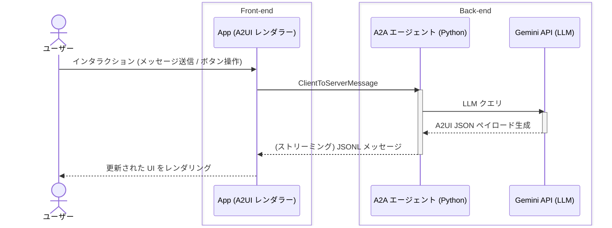

# A2UI クイックスタート: 5 分で実行する

レストラン検索デモを動かして、A2UI を実際に体験してみましょう。このガイドに従うと、5 分以内にエージェントが生成した UI を体験できます。

## 作成するもの

このクイックスタートを終えると、次のものが手元に完成します:

- A2UI レンダラー（Lit または Flutter）が動作するアプリ
- 動的 UI を生成する Gemini ベースのエージェント
- フォーム生成、時間選択、確認フローを備えたインタラクティブなレストラン検索画面
- エージェントから UI まで A2UI メッセージが流れる仕組みの理解

## 前提条件

開始する前に、使用するクライアントフレームワークを選択してください:

=== "Lit"

    - **Node.js**（v18 以降、[Corepack](https://nodejs.org/api/corepack.html) を有効化） — [ダウンロード](https://nodejs.org/)

=== "Flutter"

    - **Flutter SDK** — [インストール手順](https://docs.flutter.dev/install)

**共通の前提条件:**

- **uv**（Python パッケージマネージャー） — [インストール手順](https://docs.astral.sh/uv/getting-started/installation/)（Python エージェントバックエンドの実行に使用）
- **Gemini API キー** — [Google AI Studio で無料取得](https://aistudio.google.com/apikey)

> [!WARNING]
> **セキュリティ注意**
>
> このデモは Gemini を使って A2UI 応答を生成する A2A エージェントを実行します。エージェントは API キーにアクセスし、Google の Gemini API にリクエストを送信します。本番環境で実行する前に、必ずエージェントコードを確認してください。

## ステップ 1: リポジトリをクローンする

```bash
git clone https://github.com/a2ui-project/a2ui.git
cd a2ui
```

## ステップ 2: API キーを設定する

Gemini API キーを環境変数として設定します:

```bash
export GEMINI_API_KEY="your_gemini_api_key_here"
```

## ステップ 3: エージェントとクライアントを実行する

=== "Lit"

    クライアントアプリケーションのソースコードは `samples/client/lit/shell` にあります。デモを実行するために、親にあたる samples ディレクトリへ移動します:

    ```bash
    cd samples/client/lit

    # Corepack を有効化（macOS Homebrew ユーザーは下記のヒントを参照）
    corepack enable

    yarn install
    yarn demo:restaurant
    ```

    ??? note "エージェントとクライアントを個別に実行する"
        `demo:restaurant` コマンドは A2A エージェントと Web クライアントを自動的に起動します。これは次の手順と同等です:

        **1. エージェントを実行:**

        ```bash
        cd samples/agent/adk/restaurant_finder
        uv run .
        ```

        **2. クライアントを実行:**

        ```bash
        cd samples/client/lit/shell
        yarn dev
        ```

    > [!INFO]
    > **パッケージマネージャーについて:**
    >
    > A2UI リポジトリは自身の開発に `yarn` を使用していますが、A2UI を**使用**するために `yarn` が必須なわけではありません。ご自身のプロジェクトでは好みのパッケージマネージャー（`npm` や `pnpm` など）を自由に使用できます。

=== "Flutter"

    **1. エージェントを実行:**

    1 つ目のターミナルで Python エージェントバックエンドを起動します:

    ```bash
    cd samples/agent/adk/restaurant_finder
    uv run .
    ```

    **2. クライアントを実行:**

    2 つ目のターミナルで Flutter Web アプリケーションを起動します:

    ```bash
    cd samples/client/flutter/restaurant_finder/app
    flutter run -d chrome
    ```

> [!TIP]
> **デモ起動完了**
>
> すべてが正常に動作していれば、デモアプリが表示されます。これでエージェントは UI を生成できる状態です！

## ステップ 4: 試してみる

Web アプリで次のプロンプトを試してください:

1. **"Book a table for 2"** - エージェントが予約フォームを生成する様子を確認
2. **"Find Italian restaurants near me"** - 動的な検索結果を確認
3. **"What are your hours?"** - 意図ごとに異なる UI レイアウトを体験

デモアプリケーションはエージェントからの各応答に応じて画面を更新し、すべての UI は Gemini LLM によって完全に動的に生成されます。**結果の画面（レストラン一覧、予約フロー、予約確認など）はアプリのソースコードにハードコードされていません。**

---

## どのように動作するのか？

このデモアプリがどのように構成されているか、そして A2UI を使って同様のアプリケーションをどのように構築できるか詳しく見ていきましょう。

### インタラクションシーケンス図



1. **ユーザーが操作**: アプリを操作します（メッセージ送信、ボタンクリックなど）。
2. **A2A エージェントが受信**: 会話を受け取り Gemini に渡します。
3. **Gemini が A2UI JSON 生成**: UI を記述するメッセージを生成します。
4. **A2A エージェントがストリーミング**: このメッセージをアプリにストリーミングします。
5. **A2UI レンダラーが変換**: ネイティブ UI コンポーネントへ変換します。
6. **アプリ UI が更新**: 画面が自動的に更新されます。

### A2UI JSON ペイロード

エージェントが何を返しているか見てみましょう。以下は簡略化された JSON メッセージの例です:

=== "v0.9"

    **サーフェスの作成:**

    ```json
    { "version": "v0.9.1",
      "createSurface": {
        "surfaceId": "main",
        "catalogId": "https://a2ui.org/specification/v0_9_1/catalogs/basic/catalog.json"
      }}
    ```

    **UI の定義:**

    ```json
    { "version": "v0.9.1",
      "updateComponents": {
        "surfaceId": "main",
        "components": [
          {"id": "header", "component": "Text", "text": "# Book Your Table", "variant": "h1"},
          {"id": "date-picker", "component": "DateTimeInput", "label": "Select Date", "value": {"path": "/reservation/date"}, "enableDate": true},
          {"id": "submit-text", "component": "Text", "text": "Confirm Reservation"},
          {"id": "submit-btn", "component": "Button", "child": "submit-text", "variant": "primary", "action": {"event": {"name": "confirm_booking"}}}
        ]
      }}
    ```

    **データの入力:**

    ```json
    { "version": "v0.9.1",
      "updateDataModel": {
        "surfaceId": "main",
        "path": "/reservation",
        "value": {"date": "2025-12-15", "time": "19:00", "guests": 2}
      }}
    ```

=== "レガシー (v0.8)"

    **UI の定義:**

    ```json
    {"surfaceUpdate": {"surfaceId": "main", "components": [
      {"id": "header", "component": {"Text": {"text": {"literalString": "Book Your Table"}, "usageHint": "h1"}}},
      {"id": "date-picker", "component": {"DateTimeInput": {"label": {"literalString": "Select Date"}, "value": {"path": "/reservation/date"}, "enableDate": true}}},
      {"id": "submit-text", "component": {"Text": {"text": {"literalString": "Confirm Reservation"}}}},
      {"id": "submit-btn", "component": {"Button": {"child": "submit-text", "action": {"name": "confirm_booking"}}}}
    ]}}
    ```

    **データの入力:**

    ```json
    {"dataModelUpdate": {"surfaceId": "main", "contents": [
      {"key": "reservation", "valueMap": [
        {"key": "date", "valueString": "2025-12-15"},
        {"key": "time", "valueString": "19:00"},
        {"key": "guests", "valueInt": 2}
      ]}
    ]}}
    ```

    **レンダリング開始シグナル:**

    ```json
    {"beginRendering": {"surfaceId": "main", "root": "header"}}
    ```

    注: v0.8 では `createSurface` は `beginRendering` であり、コンポーネントはネストされた構造で、データモデルはフラットな JSON ではなく隣接リストを使用していました。

> [!TIP]
> **単なる JSON です**
>
> この構造がどれほど読みやすく整理されているか分かりますか？ LLM はこれを容易に生成でき、**コード実行なしで**安全に送信およびレンダリングできます。

### ソースコードを見てみる

実際のコード構成を確認したい場合は、以下を参照してください:

- **エージェントコード**: `samples/agent/adk/restaurant_finder/` — Python A2A エージェント

=== "Lit"

    - **クライアントコード**: `samples/client/lit/` — A2UI レンダラーを含む Lit Web クライアント
    - **A2UI レンダラー**: `renderers/lit/`（Lit）および `renderers/web_core/`（フレームワーク非依存コア）

=== "Flutter"

    - **クライアントコード**: `samples/client/flutter/` — A2UI レンダラーを含む Flutter Web クライアント
    - **A2UI レンダラー**: `dart/a2ui_flutter/`（Flutter）

各ディレクトリには詳細なドキュメントを含む独自の README があります。

---

## トラブルシューティング

=== "Lit"

    ### ポートが既に使用されている場合

    ポート 5173 がすでに使用されている場合、開発サーバーは自動的に次の利用可能なポートを試行します。ターミナル出力で実際の URL を確認してください。

    ### Corepack および Homebrew の問題

    スタンドアロンのパッケージマネージャーがインストールされている場合は、Corepack がプロジェクトごとにバージョンを管理できるよう、インストール前に競合を解除（unlink）してください:

    > ```bash
    > $ brew unlink yarn pnpm
    > $ brew install corepack
    > $ corepack enable
    > ```

=== "Flutter"

    <!--- Flutter デモのトラブルシューティングアドバイスをここに記述できます。 --->

### API キーの問題

API キーが見つからないというエラーが表示された場合:

1. キーが export されているか確認: `echo $GEMINI_API_KEY`
2. [Google AI Studio](https://aistudio.google.com/apikey) で取得した有効な Gemini API キーであることを確認
3. 再度設定を試す: `export GEMINI_API_KEY="your_key"`

### 起動時の接続エラー

ブラウザが開いたときに `ERR_CONNECTION_REFUSED` エラーが表示されても、**心配いりません** — これは既知の競合状態（レースコンディション）です。Web アプリが Python エージェントバックエンドよりも先に起動することがあります。数秒待ってからページを更新してください。

### Python / uv の問題

デモエージェントの実行には [uv](https://docs.astral.sh/uv/) が必要です。`uv: command not found` と表示される場合:

```bash
# uv のインストール
curl -LsSf https://astral.sh/uv/install.sh | sh

# バージョン確認
uv --version
```

その他の Python エラーが発生した場合:

```bash
# Python 3.10 以上が利用可能か確認
python3 --version

# エージェントを手動で実行してみる
cd samples/agent/adk/restaurant_finder
uv run .
```

### それでも問題が解決しない場合

- [GitHub Issues](https://github.com/a2ui-project/a2ui/issues) を確認
- サンプルの README.md（[Lit](../../samples/client/lit) または [Flutter](../../samples/client/flutter)）を確認
- コミュニティディスカッションに参加

---

## さらにデモを探索する

=== "Lit"

    ### Lit コンポーネントギャラリー（エージェント不要）

    提供されているすべての Basic Catalog コンポーネントを確認できます:

    新規クローンしたリポジトリからギャラリーを実行する場合は、まずギャラリーとそのワークスペース依存関係をビルドします:

    ```bash
    cd renderers/lit/a2ui_explorer
    yarn build
    ```

    ギャラリーを起動します:

    ```bash
    yarn dev
    ```

    このクライアント専用デモでは、すべての標準コンポーネント（Card、Button、TextField、Timeline など）をライブサンプルとコード例とともに展示します。

=== "Flutter"

    <!--- 追加の Flutter 固有クライアントサンプルをここに記述できます。 --->

### 他の言語とフレームワーク

A2UI は `samples/client` ディレクトリで他の人気フレームワークのサンプルも提供しています:

- **Angular**: `samples/client/angular`
- **Flutter**: `samples/client/flutter`
- **Lit**: `samples/client/lit`
- **React**: `samples/client/react`

利用可能なすべてのクライアント実装を確認するには、[samples/client](../../samples/client) ディレクトリを参照してください。

---

## 次のステップ

**おめでとうございます！** 最初の A2UI アプリケーションを無事に実行できました。AI エージェントが安全で宣言的な JSON メッセージのみを使用して、Web アプリケーション上でネイティブにレンダリングされるリッチで対話的な UI を生成する仕組みを体験しました。

詳細については、以下のリンクを参照してください:

- **[コア概念を学ぶ](concepts/overview.md)**: サーフェス、コンポーネント、データバインディングの理解
- **[エージェントを構築する](guides/agent-development.md)**: A2UI 応答を生成するエージェントの作成
- **[独自のクライアントをセットアップする](guides/client-setup.md)**: 自身のアプリへの A2UI 統合
- **[独自のカタログを定義する](guides/defining-your-own-catalog.md)**: Basic Catalog を超えて、アプリ生成に使用される UI 要素を制御
- **[既存のエージェントアプリを活用する](guides/a2ui-with-any-agent-framework.md)**: CopilotKit + AG-UI を介して ADK、LangGraph、CrewAI、Mastra またはカスタムサービスに A2UI を追加
- **[プロトコルを調べる](reference/messages.md)**: 技術仕様の詳細
